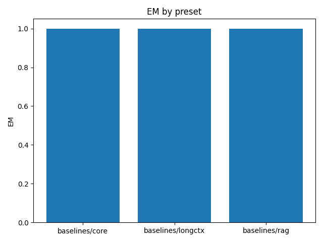

# Overall Summary

| Suite | Preset | em | latency_ms_mean | rss_mb | time_ms_per_100 | tokens |
|---|---|---|---|---|---|---|
| semantic | baselines/rag | 1.000 | 0.001 | 436.954 | 0.155 | 7916.667 |
| semantic | baselines/core | 1.000 | 0.001 | 436.926 | 0.156 | 7916.667 |
| semantic | baselines/longctx | 1.000 | 0.001 | 436.976 | 0.161 | 7916.667 |
| spatial | baselines/rag | 1.000 | 0.001 | 436.711 | 0.256 | 12222.556 |
| spatial | baselines/core | 1.000 | 0.002 | 436.742 | 0.280 | 12222.556 |
| spatial | baselines/longctx | 1.000 | 0.001 | 436.725 | 0.250 | 12222.556 |
| episodic | baselines/rag | 1.000 | 0.001 | 436.627 | 0.151 | 5304.444 |
| episodic | baselines/core | 1.000 | 0.001 | 436.488 | 0.149 | 5304.444 |
| episodic | baselines/longctx | 1.000 | 0.001 | 436.628 | 0.150 | 5304.444 |

## Per-suite summaries
- [episodic](episodic/summary.md)
- [semantic](semantic/summary.md)
- [spatial](spatial/summary.md)

See also: [smoke.md](smoke.md)