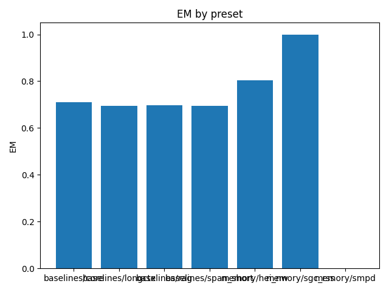

# Overall Summary

| Suite | Preset | EM (raw) | EM (norm) | EM | f1 | overlong | format_violation | generated_tokens | input_tokens | latency_ms_mean | refusal_rate | rss_mb | steps_to_goal | suboptimality_ratio | success_rate | time_ms_per_100 | total_tokens |
|---|---|---|---|---|---|---|---|---|---|---|---|---|---|---|---|---|---|
| episodic_cross | baselines/rag | 0.000 | 1.000 | 1.000 | 0.240 | 0.000 | 0.640 | 175.000 | 2050.000 | 111.785 | 0.000 | 2880.465 | – | – | – | 251.283 | 2225.000 |
| episodic_cross | baselines/core | 0.000 | 1.000 | 1.000 | 0.253 | 0.000 | 0.620 | 172.000 | 2050.000 | 110.817 | 0.000 | 3522.992 | – | – | – | 249.444 | 2222.000 |
| episodic_cross | baselines/span_short | 0.000 | 1.000 | 1.000 | 0.200 | 0.000 | 0.700 | 171.000 | 2050.000 | 110.908 | 0.000 | 2339.211 | – | – | – | 249.761 | 2221.000 |
| episodic_cross | baselines/longctx | 0.000 | 1.000 | 1.000 | 0.213 | 0.000 | 0.680 | 175.000 | 2050.000 | 112.586 | 0.000 | 2335.473 | – | – | – | 253.083 | 2225.000 |
| episodic_cross | memory/hei_nw | 0.000 | 1.000 | 1.000 | 0.213 | 0.000 | 0.680 | 169.000 | 2050.000 | 115.937 | 0.000 | 1814.145 | – | – | – | 261.311 | 2219.000 |
| semantic | baselines/rag | 0.720 | 1.000 | 1.000 | 0.720 | 0.000 | 0.280 | 125.000 | 2450.000 | 87.921 | 0.000 | 2572.160 | – | – | – | 170.808 | 2575.000 |
| semantic | baselines/core | 0.600 | 1.000 | 1.000 | 0.600 | 0.000 | 0.400 | 131.000 | 2450.000 | 90.569 | 0.000 | 2319.074 | – | – | – | 175.526 | 2581.000 |
| semantic | baselines/span_short | 0.660 | 1.000 | 1.000 | 0.660 | 0.000 | 0.340 | 128.000 | 2450.000 | 89.311 | 0.000 | 1753.184 | – | – | – | 173.292 | 2578.000 |
| semantic | baselines/longctx | 0.680 | 1.000 | 1.000 | 0.680 | 0.000 | 0.320 | 127.000 | 2450.000 | 89.306 | 0.000 | 2950.109 | – | – | – | 173.357 | 2577.000 |
| semantic | memory/sgc_rss | 0.720 | 1.000 | 1.000 | 0.720 | 0.000 | 0.280 | 125.000 | 2450.000 | 90.931 | 0.000 | 1709.234 | – | – | – | 176.637 | 2575.000 |
| episodic_multi | baselines/rag | 0.600 | 0.640 | 0.640 | 0.600 | 0.360 | 0.380 | 155.000 | 5300.000 | 121.609 | 0.000 | 3176.129 | – | – | – | 111.505 | 5455.000 |
| episodic_multi | baselines/core | 0.600 | 0.640 | 0.640 | 0.600 | 0.360 | 0.380 | 155.000 | 5300.000 | 119.681 | 0.000 | 2780.156 | – | – | – | 109.733 | 5455.000 |
| episodic_multi | baselines/span_short | 0.600 | 0.600 | 0.600 | 0.600 | 0.400 | 0.400 | 160.000 | 5300.000 | 124.343 | 0.000 | 1744.008 | – | – | – | 113.902 | 5460.000 |
| episodic_multi | baselines/longctx | 0.540 | 0.600 | 0.600 | 0.540 | 0.400 | 0.440 | 162.000 | 5300.000 | 124.746 | 0.000 | 3074.230 | – | – | – | 114.229 | 5462.000 |
| episodic_multi | memory/hei_nw | 0.600 | 0.640 | 0.640 | 0.600 | 0.340 | 0.360 | 152.000 | 5300.000 | 124.191 | 0.000 | 1693.086 | – | – | – | 113.926 | 5452.000 |
| spatial | baselines/rag | 0.000 | 0.020 | 0.020 | 0.000 | 0.340 | 0.020 | 940.000 | 3484.000 | 521.834 | 0.000 | 2661.613 | 4.220 | 1.203 | 0.020 | 589.823 | 4424.000 |
| spatial | baselines/core | 0.000 | 0.000 | 0.000 | 0.000 | 0.340 | 0.000 | 1108.000 | 3484.000 | 603.812 | 0.000 | 2497.582 | 4.320 | 1.297 | 0.000 | 657.499 | 4592.000 |
| spatial | baselines/span_short | 0.000 | 0.000 | 0.000 | 0.000 | 0.340 | 0.020 | 1052.000 | 3484.000 | 578.959 | 0.000 | 1751.508 | 4.180 | 1.238 | 0.000 | 638.222 | 4536.000 |
| spatial | baselines/longctx | 0.000 | 0.000 | 0.000 | 0.000 | 0.340 | 0.000 | 1031.000 | 3484.000 | 571.614 | 0.000 | 3073.422 | 4.240 | 1.241 | 0.000 | 633.054 | 4515.000 |
| spatial | memory/smpd | 0.000 | 0.000 | 0.000 | 0.000 | 0.340 | 0.040 | 911.000 | 3484.000 | 494.472 | 0.000 | 1768.055 | 4.160 | 1.246 | 0.000 | 562.578 | 4395.000 |
| episodic_capacity | baselines/rag | 0.000 | 0.940 | 0.940 | 0.164 | 0.060 | 0.780 | 195.000 | 15150.000 | 225.877 | 0.000 | 2324.785 | – | – | – | 73.612 | 15345.000 |
| episodic_capacity | baselines/core | 0.000 | 0.980 | 0.980 | 0.166 | 0.020 | 0.760 | 184.000 | 15150.000 | 220.071 | 0.000 | 2309.500 | – | – | – | 71.771 | 15334.000 |
| episodic_capacity | baselines/span_short | 0.000 | 0.920 | 0.920 | 0.183 | 0.080 | 0.760 | 193.000 | 15150.000 | 225.467 | 0.000 | 2865.695 | – | – | – | 73.487 | 15343.000 |
| episodic_capacity | baselines/longctx | 0.000 | 0.920 | 0.920 | 0.183 | 0.080 | 0.760 | 194.000 | 15150.000 | 225.039 | 0.000 | 2927.707 | – | – | – | 73.344 | 15344.000 |
| episodic_capacity | memory/hei_nw | 0.000 | 0.940 | 0.940 | 0.177 | 0.060 | 0.760 | 191.000 | 15150.000 | 224.464 | 0.000 | 1690.590 | – | – | – | 73.169 | 15341.000 |
| episodic | baselines/rag | 0.100 | 0.580 | 0.580 | 0.357 | 0.420 | 0.600 | 234.000 | 1970.000 | 141.769 | 0.000 | 2702.797 | – | – | – | 321.700 | 2204.000 |
| episodic | baselines/core | 0.160 | 0.640 | 0.640 | 0.357 | 0.360 | 0.620 | 222.000 | 1970.000 | 141.432 | 0.000 | 1701.082 | – | – | – | 322.693 | 2192.000 |
| episodic | baselines/span_short | 0.120 | 0.640 | 0.640 | 0.356 | 0.360 | 0.620 | 225.000 | 1970.000 | 137.794 | 0.000 | 1739.137 | – | – | – | 313.956 | 2195.000 |
| episodic | baselines/longctx | 0.120 | 0.640 | 0.640 | 0.354 | 0.360 | 0.600 | 219.000 | 1970.000 | 135.370 | 0.000 | 2345.074 | – | – | – | 309.299 | 2189.000 |
| episodic | memory/hei_nw | 0.080 | 0.640 | 0.640 | 0.297 | 0.360 | 0.640 | 223.000 | 1970.000 | 142.569 | 0.000 | 1706.562 | – | – | – | 325.128 | 2193.000 |

## Gate Telemetry
| status | mem | duplicate_rate | nodes_per_1k | edges_per_1k |
|---|---|---|---|---|
| on | relational | nan | nan | nan |
| on | spatial | nan | nan | nan |

## Per-suite summaries
- [episodic](episodic/summary.md)
- [episodic_capacity](episodic_capacity/summary.md)
- [episodic_cross](episodic_cross/summary.md)
- [episodic_multi](episodic_multi/summary.md)
- [semantic](semantic/summary.md)
- [spatial](spatial/summary.md)