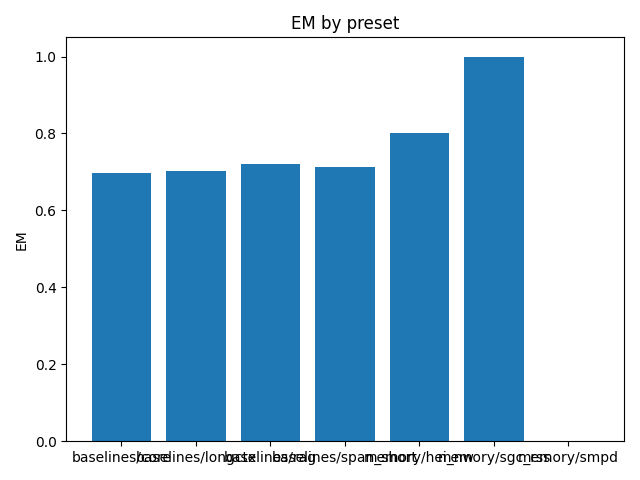

# Overall Summary

| Suite | Preset | EM (raw) | EM (norm) | EM | f1 | overlong | format_violation | generated_tokens | input_tokens | latency_ms_mean | refusal_rate | rss_mb | steps_to_goal | suboptimality_ratio | success_rate | time_ms_per_100 | total_tokens |
|---|---|---|---|---|---|---|---|---|---|---|---|---|---|---|---|---|---|
| episodic_cross | baselines/rag | 0.000 | 1.000 | 1.000 | 0.267 | 0.000 | 0.600 | 171.000 | 2050.000 | 110.308 | 0.000 | 3781.789 | – | – | – | 248.402 | 2221.000 |
| episodic_cross | baselines/core | 0.000 | 1.000 | 1.000 | 0.227 | 0.000 | 0.660 | 172.000 | 2050.000 | 111.250 | 0.000 | 2303.812 | – | – | – | 250.414 | 2222.000 |
| episodic_cross | baselines/span_short | 0.000 | 1.000 | 1.000 | 0.160 | 0.000 | 0.760 | 175.000 | 2050.000 | 112.470 | 0.000 | 2894.805 | – | – | – | 252.815 | 2225.000 |
| episodic_cross | baselines/longctx | 0.000 | 1.000 | 1.000 | 0.213 | 0.000 | 0.680 | 172.000 | 2050.000 | 111.114 | 0.000 | 3035.703 | – | – | – | 250.103 | 2222.000 |
| episodic_cross | memory/hei_nw | 0.000 | 1.000 | 1.000 | 0.280 | 0.000 | 0.580 | 163.000 | 2050.000 | 110.597 | 0.000 | 1684.461 | – | – | – | 249.951 | 2213.000 |
| semantic | baselines/rag | 0.680 | 1.000 | 1.000 | 0.680 | 0.000 | 0.320 | 127.000 | 2450.000 | 89.953 | 0.000 | 2411.844 | – | – | – | 174.598 | 2577.000 |
| semantic | baselines/core | 0.620 | 1.000 | 1.000 | 0.620 | 0.000 | 0.380 | 130.000 | 2450.000 | 91.042 | 0.000 | 1727.387 | – | – | – | 176.506 | 2580.000 |
| semantic | baselines/span_short | 0.580 | 1.000 | 1.000 | 0.580 | 0.000 | 0.420 | 132.000 | 2450.000 | 95.775 | 0.000 | 2716.711 | – | – | – | 185.542 | 2582.000 |
| semantic | baselines/longctx | 0.520 | 1.000 | 1.000 | 0.520 | 0.000 | 0.480 | 135.000 | 2450.000 | 93.331 | 0.000 | 2874.137 | – | – | – | 180.588 | 2585.000 |
| semantic | memory/sgc_rss | 0.740 | 1.000 | 1.000 | 0.740 | 0.000 | 0.260 | 124.000 | 2450.000 | 95.663 | 0.000 | 1772.188 | – | – | – | 185.887 | 2574.000 |
| episodic_multi | baselines/rag | 0.620 | 0.680 | 0.680 | 0.620 | 0.320 | 0.340 | 149.000 | 5300.000 | 119.115 | 0.000 | 3633.590 | – | – | – | 109.332 | 5449.000 |
| episodic_multi | baselines/core | 0.540 | 0.600 | 0.600 | 0.540 | 0.400 | 0.420 | 161.000 | 5300.000 | 123.523 | 0.000 | 2402.574 | – | – | – | 113.129 | 5461.000 |
| episodic_multi | baselines/span_short | 0.600 | 0.600 | 0.600 | 0.600 | 0.400 | 0.400 | 160.000 | 5300.000 | 122.895 | 0.000 | 2676.027 | – | – | – | 112.574 | 5460.000 |
| episodic_multi | baselines/longctx | 0.560 | 0.620 | 0.620 | 0.560 | 0.360 | 0.380 | 155.000 | 5300.000 | 119.772 | 0.000 | 2287.426 | – | – | – | 109.815 | 5455.000 |
| episodic_multi | memory/hei_nw | 0.600 | 0.620 | 0.620 | 0.600 | 0.360 | 0.380 | 155.000 | 5300.000 | 124.761 | 0.000 | 1686.637 | – | – | – | 114.386 | 5455.000 |
| spatial | baselines/rag | 0.000 | 0.040 | 0.040 | 0.000 | 0.340 | 0.020 | 975.000 | 3484.000 | 520.156 | 0.000 | 3268.906 | 4.240 | 1.259 | 0.040 | 583.302 | 4459.000 |
| spatial | baselines/core | 0.000 | 0.000 | 0.000 | 0.000 | 0.340 | 0.000 | 933.000 | 3484.000 | 509.113 | 0.000 | 2296.832 | 4.300 | 1.257 | 0.000 | 576.349 | 4417.000 |
| spatial | baselines/span_short | 0.000 | 0.020 | 0.020 | 0.000 | 0.340 | 0.020 | 989.000 | 3484.000 | 528.024 | 0.000 | 2779.859 | 4.160 | 1.214 | 0.020 | 590.269 | 4473.000 |
| spatial | baselines/longctx | 0.000 | 0.020 | 0.020 | 0.000 | 0.340 | 0.020 | 919.000 | 3484.000 | 492.797 | 0.000 | 2580.855 | 4.300 | 1.258 | 0.020 | 559.653 | 4403.000 |
| spatial | memory/smpd | 0.000 | 0.000 | 0.000 | 0.000 | 0.340 | 0.060 | 997.000 | 3484.000 | 535.658 | 0.000 | 1683.684 | 4.320 | 1.235 | 0.000 | 597.735 | 4481.000 |
| episodic_capacity | baselines/rag | 0.000 | 0.940 | 0.940 | 0.190 | 0.060 | 0.740 | 189.000 | 15150.000 | 219.049 | 0.000 | 3801.230 | – | – | – | 71.414 | 15339.000 |
| episodic_capacity | baselines/core | 0.000 | 0.980 | 0.980 | 0.179 | 0.020 | 0.740 | 183.000 | 15150.000 | 220.575 | 0.000 | 2674.141 | – | – | – | 71.939 | 15333.000 |
| episodic_capacity | baselines/span_short | 0.000 | 0.980 | 0.980 | 0.166 | 0.020 | 0.760 | 185.000 | 15150.000 | 216.463 | 0.000 | 3346.234 | – | – | – | 70.589 | 15335.000 |
| episodic_capacity | baselines/longctx | 0.000 | 0.940 | 0.940 | 0.177 | 0.060 | 0.760 | 190.000 | 15150.000 | 219.111 | 0.000 | 3193.801 | – | – | – | 71.428 | 15340.000 |
| episodic_capacity | memory/hei_nw | 0.000 | 0.940 | 0.940 | 0.137 | 0.060 | 0.820 | 195.000 | 15150.000 | 227.056 | 0.000 | 1709.207 | – | – | – | 73.994 | 15345.000 |
| episodic | baselines/rag | 0.080 | 0.660 | 0.660 | 0.282 | 0.340 | 0.660 | 219.000 | 1970.000 | 132.989 | 0.000 | 3170.570 | – | – | – | 303.836 | 2189.000 |
| episodic | baselines/core | 0.040 | 0.600 | 0.600 | 0.244 | 0.400 | 0.700 | 234.000 | 1970.000 | 149.790 | 0.000 | 1685.062 | – | – | – | 339.890 | 2204.000 |
| episodic | baselines/span_short | 0.120 | 0.680 | 0.680 | 0.303 | 0.320 | 0.620 | 209.000 | 1970.000 | 132.796 | 0.000 | 2807.535 | – | – | – | 304.793 | 2179.000 |
| episodic | baselines/longctx | 0.120 | 0.640 | 0.640 | 0.314 | 0.360 | 0.620 | 221.000 | 1970.000 | 134.318 | 0.000 | 3833.801 | – | – | – | 306.593 | 2191.000 |
| episodic | memory/hei_nw | 0.140 | 0.640 | 0.640 | 0.357 | 0.360 | 0.580 | 221.000 | 1970.000 | 138.923 | 0.000 | 1804.074 | – | – | – | 317.098 | 2191.000 |

## Gate Telemetry
| status | mem | duplicate_rate | nodes_per_1k | edges_per_1k |
|---|---|---|---|---|
| on | relational | nan | nan | nan |
| on | spatial | nan | nan | nan |

## Per-suite summaries
- [episodic](episodic/summary.md)
- [episodic_capacity](episodic_capacity/summary.md)
- [episodic_cross](episodic_cross/summary.md)
- [episodic_multi](episodic_multi/summary.md)
- [semantic](semantic/summary.md)
- [spatial](spatial/summary.md)