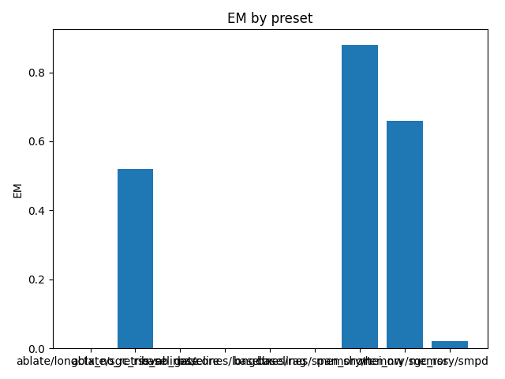

# Overall Summary

> single-seed run: CI bands unavailable

| Suite | Preset | EM (raw) | EM (norm) | EM | f1 | overlong | format_violation | generated_tokens | input_tokens | latency_ms_mean | refusal_rate | rss_mb | steps_to_goal | store_size | suboptimality_ratio | success_rate | time_ms_per_100 | total_tokens |
|---|---|---|---|---|---|---|---|---|---|---|---|---|---|---|---|---|---|---|
| semantic | ablate/longctx_no_retrieval | 0.000 | 0.000 | 0.000 | 0.000 | 0.000 | 0.000 | – | – | – | 0.000 | – | – | 5.000 | – | – | – | – |
| semantic | ablate/sgc_rss_no_gate | 0.520 | 1.000 | 1.000 | 0.520 | 0.000 | 0.480 | 135.000 | 2450.000 | 96.171 | 0.000 | 1800.656 | – | 155.000 | – | – | 186.074 | 2585.000 |
| semantic | baselines/rag | 0.000 | 0.000 | 0.000 | 0.000 | 0.000 | 0.000 | – | – | – | 0.000 | – | – | 5.000 | – | – | – | – |
| semantic | baselines/core | 0.000 | 0.000 | 0.000 | 0.000 | 0.000 | 0.000 | – | – | – | 0.000 | – | – | 5.000 | – | – | – | – |
| semantic | baselines/span_short | 0.000 | 0.000 | 0.000 | 0.000 | 0.000 | 0.000 | – | – | – | 0.000 | – | – | 5.000 | – | – | – | – |
| semantic | baselines/longctx | 0.000 | 0.000 | 0.000 | 0.000 | 0.000 | 0.000 | – | – | – | 0.000 | – | – | 5.000 | – | – | – | – |
| semantic | memory/sgc_rss | 0.660 | 1.000 | 1.000 | 0.660 | 0.000 | 0.340 | 128.000 | 2450.000 | 100.624 | 0.000 | 1782.191 | – | 155.000 | – | – | 195.226 | 2578.000 |
| episodic_cross | baselines/rag | 0.000 | 0.000 | 0.000 | 0.000 | 0.000 | 0.000 | – | – | – | 0.000 | – | – | 5.000 | – | – | – | – |
| episodic_cross | baselines/core | 0.000 | 0.000 | 0.000 | 0.000 | 0.000 | 0.000 | – | – | – | 0.000 | – | – | 5.000 | – | – | – | – |
| episodic_cross | baselines/span_short | 0.000 | 0.000 | 0.000 | 0.000 | 0.000 | 0.000 | – | – | – | 0.000 | – | – | 5.000 | – | – | – | – |
| episodic_cross | baselines/longctx | 0.000 | 0.000 | 0.000 | 0.000 | 0.000 | 0.000 | – | – | – | 0.000 | – | – | 5.000 | – | – | – | – |
| episodic_cross | memory/hei_nw | 0.000 | 1.000 | 1.000 | 0.187 | 0.000 | 0.720 | 173.000 | 2050.000 | 112.586 | 0.000 | 1776.465 | – | 155.000 | – | – | 253.287 | 2223.000 |
| episodic_multi | baselines/rag | 0.000 | 0.000 | 0.000 | 0.000 | 0.000 | 0.000 | – | – | – | 0.000 | – | – | 5.000 | – | – | – | – |
| episodic_multi | baselines/core | 0.000 | 0.000 | 0.000 | 0.000 | 0.000 | 0.000 | – | – | – | 0.000 | – | – | 5.000 | – | – | – | – |
| episodic_multi | baselines/span_short | 0.000 | 0.000 | 0.000 | 0.000 | 0.000 | 0.000 | – | – | – | 0.000 | – | – | 5.000 | – | – | – | – |
| episodic_multi | baselines/longctx | 0.000 | 0.000 | 0.000 | 0.000 | 0.000 | 0.000 | – | – | – | 0.000 | – | – | 5.000 | – | – | – | – |
| episodic_multi | memory/hei_nw | 0.920 | 0.920 | 0.920 | 0.920 | 0.000 | 0.000 | 100.000 | 2100.000 | 78.093 | 0.000 | 1713.250 | – | 155.000 | – | – | 177.545 | 2200.000 |
| spatial | baselines/rag | 0.000 | 0.000 | 0.000 | 0.000 | 0.000 | 0.000 | – | – | – | 0.000 | – | – | 5.000 | – | – | – | – |
| spatial | baselines/core | 0.000 | 0.000 | 0.000 | 0.000 | 0.000 | 0.000 | – | – | – | 0.000 | – | – | 5.000 | – | – | – | – |
| spatial | baselines/span_short | 0.000 | 0.000 | 0.000 | 0.000 | 0.000 | 0.000 | – | – | – | 0.000 | – | – | 5.000 | – | – | – | – |
| spatial | baselines/longctx | 0.000 | 0.000 | 0.000 | 0.000 | 0.000 | 0.000 | – | – | – | 0.000 | – | – | 5.000 | – | – | – | – |
| spatial | memory/smpd | 0.000 | 0.020 | 0.020 | 0.000 | 0.340 | 0.000 | 1017.000 | 3484.000 | 545.677 | 0.000 | 1782.500 | 4.280 | 155.000 | 1.267 | 0.020 | 606.207 | 4501.000 |
| episodic_capacity | baselines/rag | 0.000 | 0.000 | 0.000 | 0.000 | 0.000 | 0.000 | – | – | – | 0.000 | – | – | 5.000 | – | – | – | – |
| episodic_capacity | baselines/core | 0.000 | 0.000 | 0.000 | 0.000 | 0.000 | 0.000 | – | – | – | 0.000 | – | – | 5.000 | – | – | – | – |
| episodic_capacity | baselines/span_short | 0.000 | 0.000 | 0.000 | 0.000 | 0.000 | 0.000 | – | – | – | 0.000 | – | – | 5.000 | – | – | – | – |
| episodic_capacity | baselines/longctx | 0.000 | 0.000 | 0.000 | 0.000 | 0.000 | 0.000 | – | – | – | 0.000 | – | – | 5.000 | – | – | – | – |
| episodic_capacity | memory/hei_nw | 0.000 | 0.980 | 0.980 | 0.166 | 0.020 | 0.760 | 186.000 | 15150.000 | 223.886 | 0.000 | 1694.859 | – | 155.000 | – | – | 73.004 | 15336.000 |
| episodic | baselines/rag | 0.000 | 0.000 | 0.000 | 0.000 | 0.000 | 0.000 | – | – | – | 0.000 | – | – | 5.000 | – | – | – | – |
| episodic | baselines/core | 0.000 | 0.000 | 0.000 | 0.000 | 0.000 | 0.000 | – | – | – | 0.000 | – | – | 5.000 | – | – | – | – |
| episodic | baselines/span_short | 0.000 | 0.000 | 0.000 | 0.000 | 0.000 | 0.000 | – | – | – | 0.000 | – | – | 5.000 | – | – | – | – |
| episodic | baselines/longctx | 0.000 | 0.000 | 0.000 | 0.000 | 0.000 | 0.000 | – | – | – | 0.000 | – | – | 5.000 | – | – | – | – |
| episodic | memory/hei_nw | 0.120 | 0.620 | 0.620 | 0.332 | 0.380 | 0.620 | 223.000 | 1970.000 | 137.411 | 0.000 | 1715.285 | – | 155.000 | – | – | 313.361 | 2193.000 |

## Gate Telemetry
| status | mem | duplicate_rate | nodes_per_1k | edges_per_1k |
|---|---|---|---|---|
| on | episodic | nan | nan | nan |
| on | relational | nan | nan | nan |
| on | spatial | nan | nan | nan |

## Per-suite summaries
- [episodic](episodic/summary.md)
- [episodic_capacity](episodic_capacity/summary.md)
- [episodic_cross](episodic_cross/summary.md)
- [episodic_multi](episodic_multi/summary.md)
- [semantic](semantic/summary.md)
- [spatial](spatial/summary.md)