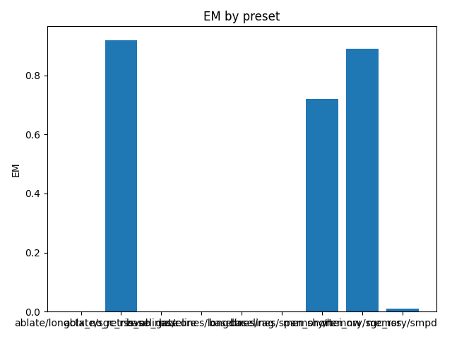

# Overall Summary

> aggregated over 2 seeds (95% CI)

| Suite | Preset | EM (raw) | EM (norm) | EM | f1 | overlong | format_violation | gate_attempts | generated_tokens | input_tokens | latency_ms_mean | refusal_rate | retrieval_episodic_requests | retrieval_relational_requests | retrieval_spatial_requests | rss_mb | steps_to_goal | store_size | suboptimality_ratio | success_rate | time_ms_per_100 | total_tokens |
|---|---|---|---|---|---|---|---|---|---|---|---|---|---|---|---|---|---|---|---|---|---|---|
| semantic | ablate/longctx_no_retrieval | 0.000 | 0.000 | 0.000 | 0.000 | 0.000 | 0.000 | 0.000 | 111.500 | 3300.000 | 99.352 | 0.000 | 0.000 | 0.000 | 0.000 | 1808.086 | – | 0.000 | – | – | 145.660 | 3411.500 |
| semantic | ablate/sgc_rss_no_gate | 0.920 | 1.000 | 1.000 | 0.920 | 0.000 | 0.080 | 0.000 | 115.000 | 3150.000 | 84.812 | 0.000 | 0.000 | 50.000 | 0.000 | 1698.826 | – | 1.000 | – | – | 129.931 | 3265.000 |
| semantic | baselines/rag | 0.000 | 0.000 | 0.000 | 0.000 | 0.000 | 0.000 | 0.000 | 114.500 | 3150.000 | 83.828 | 0.000 | 0.000 | 0.000 | 0.000 | 2068.744 | – | 0.000 | – | – | 128.453 | 3264.500 |
| semantic | baselines/core | 0.000 | 0.000 | 0.000 | 0.000 | 0.000 | 0.000 | 0.000 | 114.500 | 3150.000 | 84.138 | 0.000 | 0.000 | 0.000 | 0.000 | 2187.127 | – | 0.000 | – | – | 128.925 | 3264.500 |
| semantic | baselines/span_short | 0.000 | 0.000 | 0.000 | 0.000 | 0.000 | 0.000 | 0.000 | 114.000 | 3150.000 | 83.558 | 0.000 | 0.000 | 0.000 | 0.000 | 2063.248 | – | 0.000 | – | – | 128.066 | 3264.000 |
| semantic | baselines/longctx | 0.000 | 0.000 | 0.000 | 0.000 | 0.000 | 0.000 | 0.000 | 111.000 | 3300.000 | 96.227 | 0.000 | 0.000 | 0.000 | 0.000 | 3747.248 | – | 0.000 | – | – | 141.111 | 3411.000 |
| semantic | memory/sgc_rss | 0.890 | 1.000 | 1.000 | 0.890 | 0.000 | 0.110 | 0.000 | 116.500 | 3150.000 | 84.038 | 0.000 | 0.000 | 50.000 | 0.000 | 1765.422 | – | 1.000 | – | – | 128.684 | 3266.500 |
| episodic_cross | baselines/rag | 0.000 | 0.000 | 0.000 | 0.000 | 0.000 | 0.000 | 0.000 | 169.000 | 2058.500 | 112.544 | 0.000 | 0.000 | 0.000 | 0.000 | 2963.217 | – | 0.000 | – | – | 252.705 | 2227.500 |
| episodic_cross | baselines/core | 0.000 | 0.000 | 0.000 | 0.000 | 0.000 | 0.000 | 0.000 | 167.500 | 2058.500 | 114.318 | 0.000 | 0.000 | 0.000 | 0.000 | 2384.904 | – | 0.000 | – | – | 256.850 | 2226.000 |
| episodic_cross | baselines/span_short | 0.000 | 0.000 | 0.000 | 0.000 | 0.000 | 0.000 | 0.000 | 168.000 | 2058.500 | 111.632 | 0.000 | 0.000 | 0.000 | 0.000 | 2962.176 | – | 0.000 | – | – | 250.775 | 2226.500 |
| episodic_cross | baselines/longctx | 0.000 | 0.000 | 0.000 | 0.000 | 0.000 | 0.000 | 0.000 | 169.000 | 2208.500 | 112.195 | 0.000 | 0.000 | 0.000 | 0.000 | 2963.740 | – | 0.000 | – | – | 236.017 | 2377.500 |
| episodic_cross | memory/hei_nw | 0.000 | 1.000 | 1.000 | 0.290 | 0.000 | 0.560 | 0.000 | 161.000 | 2058.500 | 112.487 | 0.000 | 50.000 | 0.000 | 0.000 | 1707.293 | – | 5.000 | – | – | 253.477 | 2219.500 |
| episodic_multi | baselines/rag | 0.000 | 0.000 | 0.000 | 0.000 | 0.000 | 0.000 | 0.000 | 159.000 | 6100.000 | 127.052 | 0.000 | 0.000 | 0.000 | 0.000 | 2248.746 | – | 0.000 | – | – | 101.522 | 6259.000 |
| episodic_multi | baselines/core | 0.000 | 0.000 | 0.000 | 0.000 | 0.000 | 0.000 | 0.000 | 170.500 | 6100.000 | 132.487 | 0.000 | 0.000 | 0.000 | 0.000 | 3841.695 | – | 0.000 | – | – | 105.669 | 6270.500 |
| episodic_multi | baselines/span_short | 0.000 | 0.000 | 0.000 | 0.000 | 0.000 | 0.000 | 0.000 | 159.000 | 6100.000 | 127.019 | 0.000 | 0.000 | 0.000 | 0.000 | 3287.561 | – | 0.000 | – | – | 101.493 | 6259.000 |
| episodic_multi | baselines/longctx | 0.000 | 0.000 | 0.000 | 0.000 | 0.000 | 0.000 | 0.000 | 117.500 | 6250.000 | 106.107 | 0.000 | 0.000 | 0.000 | 0.000 | 2248.232 | – | 0.000 | – | – | 83.351 | 6367.500 |
| episodic_multi | memory/hei_nw | 0.560 | 0.570 | 0.570 | 0.560 | 0.400 | 0.400 | 0.000 | 160.000 | 6100.000 | 128.274 | 0.000 | 50.000 | 0.000 | 0.000 | 1755.564 | – | 5.000 | – | – | 102.470 | 6260.000 |
| spatial | baselines/rag | 0.000 | 0.000 | 0.000 | 0.000 | 0.000 | 0.000 | 0.000 | 1070.000 | 5283.500 | 600.752 | 0.000 | 0.000 | 0.000 | 0.000 | 2199.453 | – | 0.000 | – | – | 487.909 | 6353.500 |
| spatial | baselines/core | 0.000 | 0.000 | 0.000 | 0.000 | 0.000 | 0.000 | 0.000 | 1103.000 | 5283.500 | 617.710 | 0.000 | 0.000 | 0.000 | 0.000 | 3829.783 | – | 0.000 | – | – | 493.729 | 6386.500 |
| spatial | baselines/span_short | 0.000 | 0.000 | 0.000 | 0.000 | 0.000 | 0.000 | 0.000 | 990.000 | 5283.500 | 559.941 | 0.000 | 0.000 | 0.000 | 0.000 | 3010.953 | – | 0.000 | – | – | 459.386 | 6273.500 |
| spatial | baselines/longctx | 0.000 | 0.000 | 0.000 | 0.000 | 0.000 | 0.000 | 0.000 | 1082.500 | 5433.500 | 614.852 | 0.000 | 0.000 | 0.000 | 0.000 | 2424.361 | – | 0.000 | – | – | 481.193 | 6516.000 |
| spatial | memory/smpd | 0.000 | 0.010 | 0.010 | 0.000 | 0.340 | 0.040 | 0.000 | 1011.000 | 5283.500 | 544.981 | 0.000 | 0.000 | 0.000 | 50.000 | 1814.008 | 4.670 | 156.000 | 1.263 | 0.010 | 446.851 | 6294.500 |
| episodic_capacity | baselines/rag | 0.000 | 0.000 | 0.000 | 0.000 | 0.000 | 0.000 | 0.000 | 181.000 | 27950.000 | 351.202 | 0.000 | 0.000 | 0.000 | 0.000 | 2963.484 | – | 0.000 | – | – | 62.429 | 28131.000 |
| episodic_capacity | baselines/core | 0.000 | 0.000 | 0.000 | 0.000 | 0.000 | 0.000 | 0.000 | 180.000 | 27950.000 | 347.784 | 0.000 | 0.000 | 0.000 | 0.000 | 2974.441 | – | 0.000 | – | – | 61.824 | 28130.000 |
| episodic_capacity | baselines/span_short | 0.000 | 0.000 | 0.000 | 0.000 | 0.000 | 0.000 | 0.000 | 181.000 | 27950.000 | 349.901 | 0.000 | 0.000 | 0.000 | 0.000 | 2962.887 | – | 0.000 | – | – | 62.198 | 28131.000 |
| episodic_capacity | baselines/longctx | 0.000 | 0.000 | 0.000 | 0.000 | 0.000 | 0.000 | 0.000 | 173.500 | 28100.000 | 348.500 | 0.000 | 0.000 | 0.000 | 0.000 | 2963.740 | – | 0.000 | – | – | 61.637 | 28273.500 |
| episodic_capacity | memory/hei_nw | 0.000 | 0.920 | 0.920 | 0.190 | 0.080 | 0.750 | 0.000 | 189.500 | 27950.000 | 343.696 | 0.000 | 50.000 | 0.000 | 0.000 | 1739.434 | – | 5.000 | – | – | 61.076 | 28139.500 |
| episodic | baselines/rag | 0.000 | 0.000 | 0.000 | 0.000 | 0.000 | 0.000 | 0.000 | 314.000 | 2771.000 | 188.072 | 0.000 | 0.000 | 0.000 | 0.000 | 3079.686 | – | 0.000 | – | – | 304.872 | 3085.000 |
| episodic | baselines/core | 0.000 | 0.000 | 0.000 | 0.000 | 0.000 | 0.000 | 0.000 | 344.500 | 2771.000 | 200.865 | 0.000 | 0.000 | 0.000 | 0.000 | 1463.285 | – | 0.000 | – | – | 322.341 | 3115.500 |
| episodic | baselines/span_short | 0.000 | 0.000 | 0.000 | 0.000 | 0.000 | 0.000 | 0.000 | 306.500 | 2771.000 | 184.663 | 0.000 | 0.000 | 0.000 | 0.000 | 4122.295 | – | 0.000 | – | – | 300.078 | 3077.500 |
| episodic | baselines/longctx | 0.000 | 0.000 | 0.000 | 0.000 | 0.000 | 0.000 | 0.000 | 314.000 | 2921.000 | 187.062 | 0.000 | 0.000 | 0.000 | 0.000 | 4063.777 | – | 0.000 | – | – | 289.136 | 3235.000 |
| episodic | memory/hei_nw | 0.110 | 0.390 | 0.390 | 0.276 | 0.570 | 0.780 | 0.000 | 313.500 | 2771.000 | 189.745 | 0.000 | 50.000 | 0.000 | 0.000 | 1693.125 | – | 5.000 | – | – | 307.560 | 3084.500 |

## Gate Telemetry
| status | mem | duplicate_rate | nodes_per_1k | edges_per_1k |
|---|---|---|---|---|
| on | episodic | nan | nan | nan |
| on | relational | nan | nan | nan |
| on | spatial | nan | nan | nan |

## Per-suite summaries
- [episodic](episodic/summary.md)
- [episodic_capacity](episodic_capacity/summary.md)
- [episodic_cross](episodic_cross/summary.md)
- [episodic_multi](episodic_multi/summary.md)
- [semantic](semantic/summary.md)
- [spatial](spatial/summary.md)