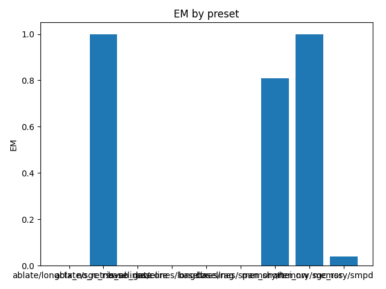

# Overall Summary

| Suite | Preset | EM (raw) | EM (norm) | EM | f1 | overlong | format_violation | generated_tokens | input_tokens | latency_ms_mean | refusal_rate | rss_mb | steps_to_goal | suboptimality_ratio | success_rate | time_ms_per_100 | total_tokens |
|---|---|---|---|---|---|---|---|---|---|---|---|---|---|---|---|---|---|
| semantic | ablate/longctx_no_retrieval | 0.000 | 0.000 | 0.000 | 0.000 | 0.000 | 0.000 | – | – | – | 0.000 | – | – | – | – | – | – |
| semantic | ablate/sgc_rss_no_gate | 0.540 | 1.000 | 1.000 | 0.540 | 0.000 | 0.460 | 134.000 | 2450.000 | 94.651 | 0.000 | 1697.516 | – | – | – | 183.200 | 2584.000 |
| semantic | baselines/rag | 0.000 | 0.000 | 0.000 | 0.000 | 0.000 | 0.000 | – | – | – | 0.000 | – | – | – | – | – | – |
| semantic | baselines/core | 0.000 | 0.000 | 0.000 | 0.000 | 0.000 | 0.000 | – | – | – | 0.000 | – | – | – | – | – | – |
| semantic | baselines/span_short | 0.000 | 0.000 | 0.000 | 0.000 | 0.000 | 0.000 | – | – | – | 0.000 | – | – | – | – | – | – |
| semantic | baselines/longctx | 0.000 | 0.000 | 0.000 | 0.000 | 0.000 | 0.000 | – | – | – | 0.000 | – | – | – | – | – | – |
| semantic | memory/sgc_rss | 0.620 | 1.000 | 1.000 | 0.620 | 0.000 | 0.380 | 130.000 | 2450.000 | 96.820 | 0.000 | 1712.246 | – | – | – | 187.697 | 2580.000 |
| episodic_cross | baselines/rag | 0.000 | 0.000 | 0.000 | 0.000 | 0.000 | 0.000 | – | – | – | 0.000 | – | – | – | – | – | – |
| episodic_cross | baselines/core | 0.000 | 0.000 | 0.000 | 0.000 | 0.000 | 0.000 | – | – | – | 0.000 | – | – | – | – | – | – |
| episodic_cross | baselines/span_short | 0.000 | 0.000 | 0.000 | 0.000 | 0.000 | 0.000 | – | – | – | 0.000 | – | – | – | – | – | – |
| episodic_cross | baselines/longctx | 0.000 | 0.000 | 0.000 | 0.000 | 0.000 | 0.000 | – | – | – | 0.000 | – | – | – | – | – | – |
| episodic_cross | memory/hei_nw | 0.000 | 1.000 | 1.000 | 0.200 | 0.000 | 0.700 | 177.000 | 2050.000 | 115.122 | 0.000 | 1708.293 | – | – | – | 258.536 | 2227.000 |
| episodic_multi | baselines/rag | 0.000 | 0.000 | 0.000 | 0.000 | 0.000 | 0.000 | – | – | – | 0.000 | – | – | – | – | – | – |
| episodic_multi | baselines/core | 0.000 | 0.000 | 0.000 | 0.000 | 0.000 | 0.000 | – | – | – | 0.000 | – | – | – | – | – | – |
| episodic_multi | baselines/span_short | 0.000 | 0.000 | 0.000 | 0.000 | 0.000 | 0.000 | – | – | – | 0.000 | – | – | – | – | – | – |
| episodic_multi | baselines/longctx | 0.000 | 0.000 | 0.000 | 0.000 | 0.000 | 0.000 | – | – | – | 0.000 | – | – | – | – | – | – |
| episodic_multi | memory/hei_nw | 0.600 | 0.640 | 0.640 | 0.600 | 0.340 | 0.380 | 153.000 | 5300.000 | 118.450 | 0.000 | 1690.543 | – | – | – | 108.634 | 5453.000 |
| spatial | baselines/rag | 0.000 | 0.000 | 0.000 | 0.000 | 0.000 | 0.000 | – | – | – | 0.000 | – | – | – | – | – | – |
| spatial | baselines/core | 0.000 | 0.000 | 0.000 | 0.000 | 0.000 | 0.000 | – | – | – | 0.000 | – | – | – | – | – | – |
| spatial | baselines/span_short | 0.000 | 0.000 | 0.000 | 0.000 | 0.000 | 0.000 | – | – | – | 0.000 | – | – | – | – | – | – |
| spatial | baselines/longctx | 0.000 | 0.000 | 0.000 | 0.000 | 0.000 | 0.000 | – | – | – | 0.000 | – | – | – | – | – | – |
| spatial | memory/smpd | 0.000 | 0.040 | 0.040 | 0.000 | 0.340 | 0.020 | 1018.000 | 3484.000 | 549.275 | 0.000 | 1782.590 | 4.320 | 1.266 | 0.040 | 610.070 | 4502.000 |
| episodic_capacity | baselines/rag | 0.000 | 0.000 | 0.000 | 0.000 | 0.000 | 0.000 | – | – | – | 0.000 | – | – | – | – | – | – |
| episodic_capacity | baselines/core | 0.000 | 0.000 | 0.000 | 0.000 | 0.000 | 0.000 | – | – | – | 0.000 | – | – | – | – | – | – |
| episodic_capacity | baselines/span_short | 0.000 | 0.000 | 0.000 | 0.000 | 0.000 | 0.000 | – | – | – | 0.000 | – | – | – | – | – | – |
| episodic_capacity | baselines/longctx | 0.000 | 0.000 | 0.000 | 0.000 | 0.000 | 0.000 | – | – | – | 0.000 | – | – | – | – | – | – |
| episodic_capacity | memory/hei_nw | 0.000 | 0.940 | 0.940 | 0.164 | 0.060 | 0.780 | 192.000 | 15150.000 | 214.800 | 0.000 | 1803.586 | – | – | – | 70.012 | 15342.000 |
| episodic | baselines/rag | 0.000 | 0.000 | 0.000 | 0.000 | 0.000 | 0.000 | – | – | – | 0.000 | – | – | – | – | – | – |
| episodic | baselines/core | 0.000 | 0.000 | 0.000 | 0.000 | 0.000 | 0.000 | – | – | – | 0.000 | – | – | – | – | – | – |
| episodic | baselines/span_short | 0.000 | 0.000 | 0.000 | 0.000 | 0.000 | 0.000 | – | – | – | 0.000 | – | – | – | – | – | – |
| episodic | baselines/longctx | 0.000 | 0.000 | 0.000 | 0.000 | 0.000 | 0.000 | – | – | – | 0.000 | – | – | – | – | – | – |
| episodic | memory/hei_nw | 0.100 | 0.660 | 0.660 | 0.292 | 0.340 | 0.660 | 219.000 | 1970.000 | 138.575 | 0.000 | 1691.652 | – | – | – | 316.601 | 2189.000 |

## Gate Telemetry
| status | mem | duplicate_rate | nodes_per_1k | edges_per_1k |
|---|---|---|---|---|
| on | relational | nan | nan | nan |
| on | spatial | nan | nan | nan |

## Per-suite summaries
- [episodic](episodic/summary.md)
- [episodic_capacity](episodic_capacity/summary.md)
- [episodic_cross](episodic_cross/summary.md)
- [episodic_multi](episodic_multi/summary.md)
- [semantic](semantic/summary.md)
- [spatial](spatial/summary.md)